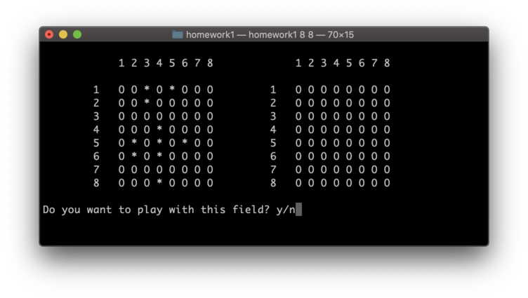

# Sea Battle

## Общее описание

В этом проекте представлен консольный вариант игры "[Морской бой](https://ru.wikipedia.org/wiki/Морской_бой_(игра))".

Запуск игры производится со следующими параметрами: height, width

После запуска игры и ввода имени игрока вас встречает основное меню игры. Тут вы можете выйти из неё нажав на клавиатуре клавишу 'f', 
а также начать игру или продолжить её нажав на клавишу 's'.

В начале игры вам будет предложено сгенерированное автоматически поле (поле игрока расположено левее), в случае, если оно кажется вам 
подходящим, вы можете нажать клавишу 'y' (yes), соглашаясь оставить его, иначе можете нажимать клавишу 'n' (no) для генерации иных полей.

Далее необходимо делать ходы, выбирая сначала строку, потом столбец, в которых может находится корабль противника (для перехода к другому параметру и подтверждения ввода необходимо нажимать клавишу enter)

## Символы встречающиеся в игре

	символ  
	  O		   клетка на поле игрока, в которой нет корабля / клетка противника, про которую ничего не известно
	  *		   клетка, в которой находится часть корабля игрока
	  -		   знак, обозначающий промах (не попадание а корабль)
	  X		   знак, символизирующий попадание в корабль
	  F		   знак, показывающий, что этим выстрелом был потоплен корабль

## Дополнительные возможности

В игре есть возможность продолжить последнюю партию, для этого после запуска из консоли достаточно ввести 'y' (без кавычек) на вопрос о продолжении предыдущей игры.
#### Будьте внимательны!
Если при запуске игры вы введёте 'n' (без кавычек), то данные о прошлой игре будут удалены